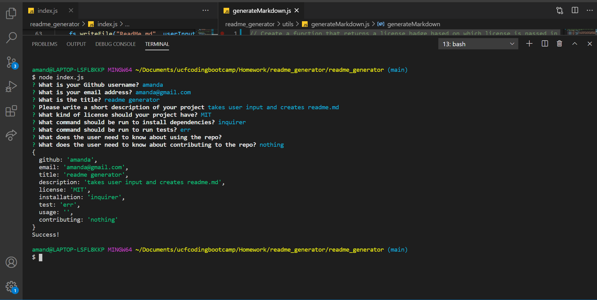
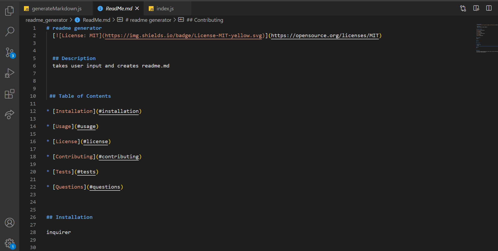
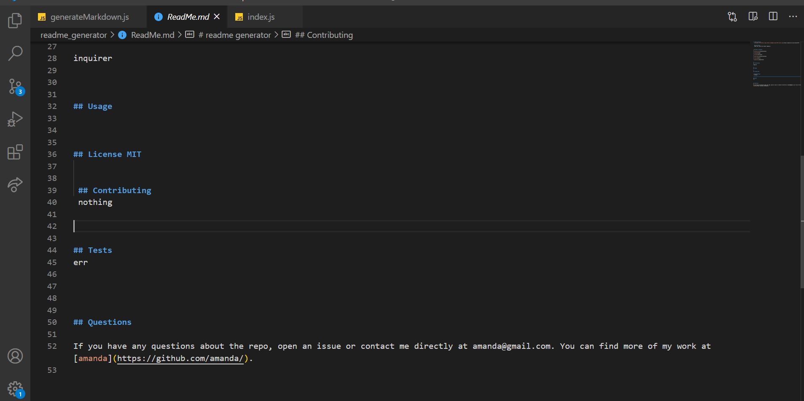

# ReadMe Generator

## Description
This will create a ReadMe generator by using the user answers from prompted questions. 

## Technologies

JavaScript ES6

Node.js

## Usage

## Maintainer
Amanda Nelson

## License
[MIT](https://choosealicense.com/licenses/mit/)